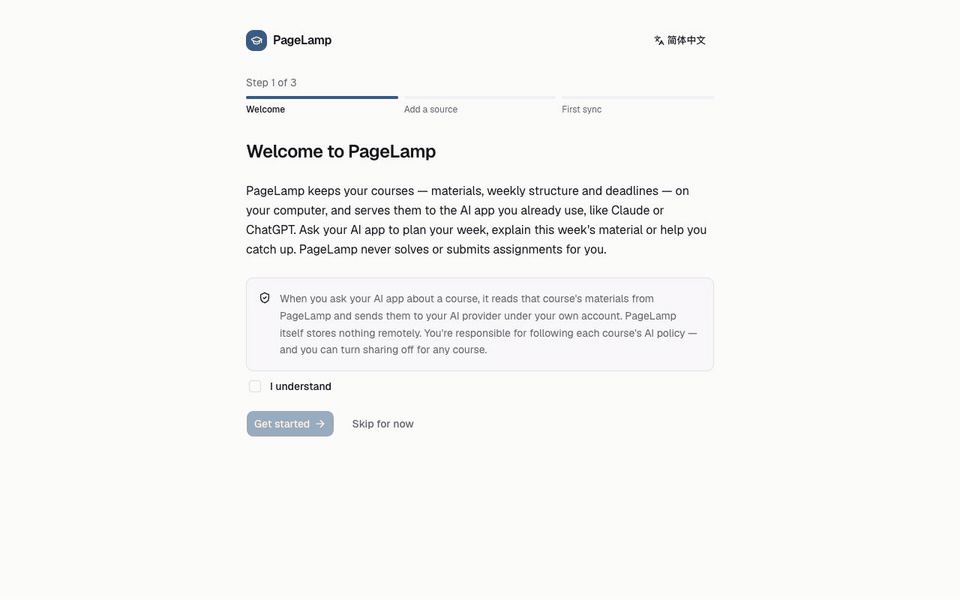

# 💡 PageLamp

**A reading lamp for your courses — so your AI app knows what you're learning.**

[](https://github.com/Euswbnix/pagelamp/actions/workflows/ci.yml)
[](LICENSE)

> **Beta.** v0.1 is new — please [report anything odd](https://github.com/Euswbnix/pagelamp/issues/new/choose).



PageLamp keeps a local, searchable picture of your courses — which week each course is in, this
week's materials, upcoming deadlines — and hands it to the AI app you already use (Claude Desktop,
ChatGPT desktop, Claude Code, Codex) through [MCP](https://modelcontextprotocol.io). Ask
*"What's happening in my courses this week?"*, *"Explain this week's lecture and cite the slides"*,
or *"Make me a study plan for the next two weeks"* — without re-uploading anything.

[中文说明 ↓](#中文说明)

## Principles

- **Local-first.** Your course data lives in a database on your computer. PageLamp runs no server,
  has no account and collects nothing. See [PRIVACY.md](PRIVACY.md).
- **Your AI, your account.** PageLamp doesn't run or resell a model; your own AI app reads your
  local course data when you ask it something.
- **Read-only and learning-first.** PageLamp never submits, posts or marks anything, and never
  fetches assignment instructions to solve them. It tells your AI app to tutor, cite its sources and
  respect each course's AI policy — and for courses you mark "No AI", it doesn't share the materials.
- **Works with any LMS.** A course folder + your LMS calendar feed works everywhere; Canvas sync with
  your own token is available for personal use.

## Install

### Desktop app (recommended)

Download the installer for your system from the
[latest release](https://github.com/Euswbnix/pagelamp/releases): `.dmg` for macOS
(`aarch64` = Apple silicon, `x64` = Intel), `.msi`/`.exe` for Windows, `.deb`/`.rpm` for Linux.
The desktop app includes the `pagelamp` command-line tool your AI app needs.

- **macOS:** open the `.dmg` and **drag PageLamp into Applications**, then open it from there —
  your AI app is pointed at that location, so don't run PageLamp from the disk image or Downloads.
  From v0.1.0 the app is signed with a Developer ID and notarized by Apple, so it opens like any
  other app: the first time, macOS asks whether to open an app downloaded from the internet —
  click **Open**.
- **Windows:** from v0.1.0 the installers, the app and the `pagelamp.exe` inside it are signed
  (Azure Artifact Signing), so Windows shows the maintainer as the verified publisher. SmartScreen
  may still show "Windows protected your PC" for a new release until the signing certificate has
  built up reputation: check that it names that publisher, then click **More info → Run anyway**.
  The `-setup.exe` installs for your account only (no administrator rights needed).
- **Linux:** the `.deb`/`.rpm` also install `pagelamp` as `/usr/bin/pagelamp`. The `.AppImage` runs
  the app, but in this beta your AI app can't use the `pagelamp` inside it — use the `.deb`/`.rpm`
  or the command-line archive for that.

On macOS and Windows the desktop app doesn't add `pagelamp` to your PATH. You don't need it to
connect your AI app — *Connect your AI app* shows the full path. To run the `pagelamp …` commands
in this README on macOS, use the full path, for example
`/Applications/PageLamp.app/Contents/MacOS/pagelamp doctor`.

### Command-line tool only

**From a release.** Download the archive for your system from the
[releases page](https://github.com/Euswbnix/pagelamp/releases), unpack it, and put `pagelamp`
(`pagelamp.exe` on Windows) in a folder on your PATH (e.g. `~/.local/bin`). On macOS the binary
is signed and notarized from v0.1.0; macOS checks that with Apple the first time it runs, so be
online for that first run. On Windows `pagelamp.exe` is signed from v0.1.0. Check with
`pagelamp --version`.

**From source.** You need Rust 1.89 or newer ([rustup.rs](https://rustup.rs)) and a C compiler
(Xcode Command Line Tools on macOS, Visual Studio Build Tools on Windows, `build-essential` on
Linux). On Windows also install NASM, or set `AWS_LC_SYS_PREBUILT_NASM=1`. Then:

```bash
git clone https://github.com/Euswbnix/pagelamp
cd pagelamp
cargo install --path apps/pagelamp-cli --locked
```

This installs `pagelamp` into `~/.cargo/bin`.

On Linux, saving a Canvas token or calendar-feed link needs a desktop keyring (GNOME Keyring or
KWallet); course folders work without one.

## Quick start

1. **Put your course files in one folder**, one sub-folder per course. Week folders help PageLamp
   tell which week each course is in:

   ```
   Courses/
     CHEM101 General Chemistry/
       course.toml          ← optional: term_start = 2026-09-08
       Week 1/  lecture01.pdf  notes.md
       Week 2/  lecture02.pptx
     MATH102 Calculus II/
       Week 1/ …
   ```

   PDF, PowerPoint (`.pptx`), Word (`.docx`), Jupyter notebooks, Markdown, text, HTML and source
   code are indexed. Older `.ppt`/`.doc` files and scanned PDFs without a text layer are listed but
   not searchable.

2. **Add your calendar feed** for deadlines (optional): in Canvas, open **Calendar → Calendar Feed**
   and copy the link; other LMSs call it "export calendar" or iCal. It's private — PageLamp keeps it
   in your system keychain.

3. **Add them and sync** — in the desktop app's onboarding, or:

   ```bash
   pagelamp folder add ~/Courses --term-start 2026-09-08
   pagelamp ical add            # paste the feed link when asked (optional)
   pagelamp canvas add --base-url https://canvas.school.edu   # optional, your own token only
   pagelamp sync
   pagelamp courses
   ```

4. **Connect your AI app.** Open *Connect your AI app* in the desktop app, or, with the
   command-line tool, run `pagelamp mcp-config claude-desktop` (also `claude-code`, `codex`), and
   follow the steps. For Claude Desktop, **quit it completely before editing its config file** — it
   saves over the file when it quits, so changes made while it's open are lost.
   Then restart your AI app and ask: *"Using PageLamp, where is each of my courses this week?"*

| AI app | How it connects | Plans |
|---|---|---|
| Claude Desktop | local MCP server in `claude_desktop_config.json` | every Claude plan, including Free |
| ChatGPT desktop (Work/Codex mode), Codex CLI | `[mcp_servers.pagelamp]` in `~/.codex/config.toml` | documented for Plus and above and Edu |
| Claude Code | the `claude mcp add …` command printed by `pagelamp mcp-config claude-code` | paid Claude plans |

### Canvas access tokens

Canvas personal access tokens are for **your own use only** — Canvas's API policy doesn't allow apps
to ask other people to create them. Tokens expire (Canvas shows the maximum when you create one).
If you share PageLamp with classmates, point them to the course folder + calendar feed setup.
Canvas sync never downloads files unless you ask, because downloads can count as "viewed" in
module requirements. Canvas records a sync like any other access: your course access report (which
instructors can see) will show the Modules, Pages, Assignments and Files lists, plus each page
PageLamp reads (only new or changed ones). Reading doesn't complete module requirements;
downloading files can.

### Course AI policies

Many universities don't allow generative AI in a course unless the instructor permits it — check
your syllabus. Record each course's policy in PageLamp (`pagelamp course policy CHEM101
learning-aid`, or the course's *AI policy* tab; values: `unknown`, `prohibited`, `learning-aid`,
`allowed-with-citation`, `unrestricted`). Your AI app sees it and adjusts; for courses marked
`prohibited` ("No AI"), PageLamp doesn't share the materials' text — titles, deadlines and your
study plan stay available for planning. You can also turn sharing off for any course
(`pagelamp course ai-access CHEM101 off`, or the switch on the course's *AI policy* tab).

## Troubleshooting and reporting problems

**Desktop app:** *Settings → Help & feedback → Copy diagnostic report* shows you the report first;
check it, then paste it into a [GitHub issue](https://github.com/Euswbnix/pagelamp/issues/new/choose).
If PageLamp closed unexpectedly, the next launch offers the same button.

**Command line:** `pagelamp doctor` checks your setup (data folder, database, keychain, sources,
AI apps). `pagelamp report --out pagelamp-report.md` writes a report to attach to an issue — read
it first. Reports contain your PageLamp version, OS, setup checks and recent log lines; course names
are replaced by "Course 1", "Course 2", and tokens, calendar-feed links and course text are removed.

**Logs** stay on your computer, in the `logs/` folder of your data folder (kept for 7 days) — open
it with *Settings → Help & feedback → Open logs folder*, or see the path printed by `pagelamp doctor`.
If your AI app can't reach PageLamp, also check the AI app's own logs — for Claude Desktop on macOS:
`~/Library/Logs/Claude/mcp.log` and `~/Library/Logs/Claude/mcp-server-pagelamp.log`.

### Canvas sync

If a Canvas sync fails or looks incomplete, run it again with diagnostics:

```bash
pagelamp sync -v
```

(or set `PAGELAMP_LOG=debug`). You'll see one line per Canvas request — for example
`GET /api/v1/courses/1234/modules → 200 (85 ms, rate limit remaining 690)` — plus Canvas's own error
message when a request fails. At the end, a per-course summary shows what was read.

- **"Canvas rejected the access token"** — the token expired or was revoked. Create a new one
  (Canvas: Account → Settings → Approved Integrations → + New Access Token) and run
  `pagelamp sources update-secret <source id>` (see `pagelamp sources`), or use *Replace token* in the
  desktop app.
- **"… not available (not available to you in Canvas)"** — that part of the course is hidden from
  students (for example the Files tab). PageLamp uses what is visible and keeps what it already has.
- **"Canvas kept throttling requests"** — wait a few minutes and sync again.

**Never paste** your Canvas access token, your calendar feed link, or copies of course materials into
an issue — even if something seems to be missing from the report.

## How it works

```
your AI app (Claude Desktop / ChatGPT desktop / Claude Code / Codex)
        │  local MCP (stdio)
        ▼
pagelamp mcp  ──reads──▶  pagelamp.db (on your computer)  ◀──writes── pagelamp sync
                                                               ▲
                              course folder · calendar feed · Canvas (read-only)
```

- `crates/` — Rust core: data model & SQLite store, text extraction, Canvas / folder / iCal
  sources, MCP server, app facade.
- `apps/pagelamp-cli` — the `pagelamp` command.
- `apps/desktop` — Tauri 2 + React desktop app.
- `docs/` — [architecture & team contract](docs/ARCHITECTURE.md), design notes.

## Roadmap

v0.1 MCP-first core, signed releases · v0.3 automatic updates, reminders, and PageLamp generates
plans and explanations itself (bring your ChatGPT/Claude subscription, an API key, or a local
model); it also reads the syllabus to work out each course's week. Details:
[docs/ARCHITECTURE.md §7](docs/ARCHITECTURE.md).

## Contributing

Bug reports, ideas and pull requests are welcome — see [CONTRIBUTING.md](CONTRIBUTING.md).
Security issues: see [SECURITY.md](SECURITY.md).

## 中文说明

PageLamp（"读书灯"：为每门课点一盏读书灯）把你的课程——每门课讲到第几周、本周材料、截止日期——整理成一份**存在你电脑上**的课程知识库，
再通过 MCP 交给你已经在用的 AI（Claude Desktop、ChatGPT 桌面版、Claude Code、Codex）。它只读、不提交任何东西、
不替你写作业；会提醒 AI 标注出处、以辅导为主，并遵守每门课的 AI 政策。

**安装**：从 [Releases](https://github.com/Euswbnix/pagelamp/releases) 下载对应系统的安装包。
macOS 请先把 PageLamp **拖进「应用程序」文件夹**再打开（AI 应用会指向这个位置，不要直接在磁盘映像或「下载」里运行）。
从 v0.1.0 起，macOS 版已用 Developer ID 签名并经过 Apple 公证，可以直接打开（第一次打开时 macOS 会问是否打开从互联网下载的应用，点「打开」即可）；Windows 版的安装包、应用和其中的 `pagelamp.exe` 也从 v0.1.0 起签名（Azure Artifact Signing）。新版本刚发布时 SmartScreen 仍可能提示「Windows 已保护你的电脑」（签名证书还在积累信誉），确认发布者是维护者本人后点「更多信息 → 仍要运行」。

**上手**：
1. 把课件放进一个文件夹，每门课一个子文件夹，里面可以按「Week 1」「Week 2」分周（支持 PDF、.pptx、.docx、Markdown、文本等；旧版 .ppt/.doc 和扫描版 PDF 只列出、不能搜索）；
2. （可选）在 Canvas 的 **Calendar → Calendar Feed** 复制日历订阅链接，用来导入截止日期；
3. 在桌面应用的引导页添加文件夹和日历订阅并同步；
4. 打开「连接 AI 应用」，按提示把 PageLamp 加到 Claude Desktop 等应用里（改 Claude Desktop 配置前要先**完全退出** Claude Desktop），重新打开后问：「用 PageLamp 看看我这周各门课在讲什么？」

**遇到问题**：在「设置 → 帮助与反馈 → 复制诊断报告…」先查看再复制报告（课程名已替换为 Course 1、Course 2，令牌和日历链接已去除），贴到 [GitHub issue](https://github.com/Euswbnix/pagelamp/issues/new/choose)。不要贴令牌、日历订阅链接或课件。

**关于 Canvas 令牌**：个人访问令牌仅供你本人使用，不要让同学生成令牌填进来；推荐给同学时请用「课程文件夹 + 日历订阅」方式。
同步时 Canvas 会像记录其他访问一样记录下来：课程访问报告（老师能看到）里会出现模块、页面、作业、文件列表，以及 PageLamp 读取的每个页面（只读新增或有变化的页面）。读取页面不会完成模块要求；下载文件可能会，所以默认不下载。

**隐私**：数据只存在你的电脑上；只有你向 AI 提问时，AI 读取的课程内容才会发到你自己的 AI 账号。详见 [PRIVACY.md](PRIVACY.md)。

## License

[Apache-2.0](LICENSE). Not affiliated with, endorsed by, or sponsored by any university or
Instructure (Canvas). Canvas is a trademark of Instructure, Inc.
